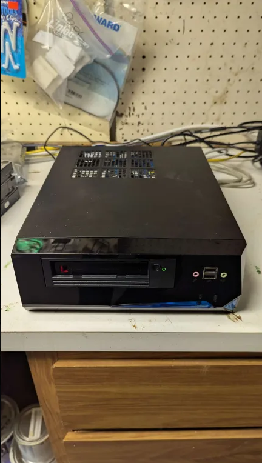
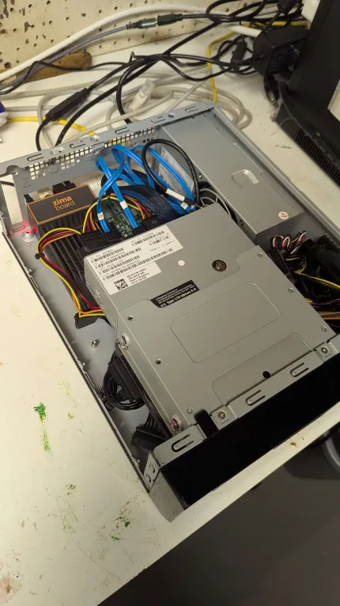

---
tags:
  - Other
---

# Tape Backup

A few months ago, I picked up a used LTO-6 internal tape drive on eBay for $300. Admittedly, it was an impulse buy. I also gambled because the seller listed it with no guarantees but a simple statement `pulled from a working server`. Luckily the gamble paid off and I received a working unit.

The reasons I looked for a tape drive in the first place were that one, I had always been curious about the tech, and two, I recently downsized my homelab significantly. Reducing storage capacity meant I would have to \***gasp**\* delete some of my _meticulously curated_ (not hoarded, mind you) media. I figured I could perhaps write them to tape drives so they weren't forever lost.

There was quite a steep learning curve and some challenges with regards to both the hardware and the software aspects of this tech. In this article, I'll chronicle my journey.

## Background

For over a decade, I relied on a main server that was built inside of a 4U rack case with three 5-in-3 hot swap cages. Initially it had a Supermicro X9SCA-F board with an Intel Xeon E5-2670v1. I'm ~~frugal~~ budget conscious when it comes to electronics and I got the CPU used, which I believe was pulled from a server at a Facebook data center. Coming from a super cheap but single core AMD Sempron 145 (later unlocked to dual core Athlon II X2 4450e... whee!), it was a tremendous upgrade. It transformed my basic NAS into a proper server that could handle multiple VMs with GPU passthrough and many docker containers. I had a dozen HDDs and multiple GPUs in there. It was a lot of fun messing around with it and I certainly had the time then. Learned a ton in the process.

Over the years, the board and the CPU got upgraded to a more modern Supermicro X11SCA-F and Intel Xeon E-2146G, and the HDDs went from a mix of 1-3TB drives to mostly 8TB drives (most of them shucked from external drives of course).

At some point I added a backup server with a budget Pentium G4600 in a midsize tower with decommissioned 1-3TB HDDs.

Fast forward to a few months ago, my needs and circumstances completely changed. We are about to move to a house with no basement, so keeping these big and noisy servers in a basement, out of sight and mind, is no longer an option. I had to consolidate and downsize everything in my homelab. Low power and low noise became an important factor.

For the main server, I opted for a tiny but relatively powerful server with an Intel N305 CPU in a Jonsbo N2 case. I detailed that server in [this article](zfshost.md).

For the backup server, I built something with almost all spare parts that I had lying around in my homelab (curated, not hoarded). It turned into a real Frankenstein's Monster of a server. I had to get pretty creative and feel real proud of the outcome. I will outline that below.

## Hardware

First of all, this backup server was not pre-planned in any way, shape or form. It is a result of a series of `oh, I should figure out a way to connect X device` and `oh wait, I do have this component in the closet` types of thoughts and evolved into its current form.

Behold the Frankenstein's Monster aka Ghettolab:





1. Tape Drive: Dell LTO-6 internal SAS drive. Main motivation for building the backup server. I really wanted to be able to use this thing that I had just acquired. But since downsizing the main server as well as the router, I had no devices I could attach this thing to. Because it's SAS, it needs an HBA, which needs a pci-e port. I was not able to find a SAS-USB adapter at a reasonable cost. It also needs SATA power, more power than a HDD, which needed a PSU.
2. HBA: Tape drive needs an HBA that supports SAS and I had an older Dell Perc 200 that was decommissioned along with my old main server. The new server ([Zfshost](zfshost.md)) only supports 5 HDDs and it has a built in backplane. Now I had to find a motherboard to hook up the HBA to.
3. Motherboard: [ZimaBoard](https://www.linuxserver.io/blog/taking-the-zimaboard-for-a-spin). I had this ZimaBoard for a few years. It's a very cool device because while it's tiny, it has a pci-e slot on the side (Gen2 x4). It served as my OPNsense router in the last couple of years, but I recently decommissioned it because with 2 SSDs and an Intel pci-e card, all hanging out, it looked too fragile (not a quality I want in a router). I replaced it with an N150 box with 4 Intel 2.5G ports, with an M2 NVME and an SSD, all internal, which looks a lot sturdier. So the Zima was a perfect choice for hosting the HBA and the tape drive.
4. PSU: I initally hooked up a decommissioned 750W PSU, which was overkill for the setup and was huge. Now I had a Medusa on my hands. ZimaBooard connected to HBA, connected to tape drive, connected to PSU, all hanging out and too fragile (not to mention ugly). Then I remembered this old case I had that happened to have a 5,25 inch slot I never used. It also had a built-in PSU (nothing fancy, but enough for the tape drive and a couple of drives). So I scrapped the separate PSU idea in favor of the case with the built-in PSU.
5. Case: An old case I had from 2008 where it served as my first HTPC case. This thing sat under my TV and served my movies and TV shows through initially Meedio, then XBMC for years. Before I built a NAS, this thing had multiple external HDDs attached to it and was starting to look like Medusa. After building a NAS and switching to an even smaller HTPC for the living room, this case moved to the basement and was connected to my 3D 1080p projector and surround sound system (man cave). After getting replace again, this time by a FireTV, it became my router, first on PfSense and later on OPNsense, with an added low profile dual nic gigabit Intel pci-e card. Finally in 2023, it was replaced by a Zimaboard with a dual nic Intel pci-e card (this time 2.5G). Since then it was sitting in a closet, looking sad. So many memories. It became perfect housing for this Monster, thanks to its built-in PSU and the 5.25 inch drive slot. I took out the old motherboard and insterted the ZimaBoard along with the HBA (held in place by velcro fastener).
6. Drives: Now that I got a backup server with a tape drive set up, I figured I could pop in a larger HDD to hold some ZFS snapshots. So I went with a decommissioned 250GB SSD as the OS drive, and I put in a decommissioned 6TB HDD with ZFS as the data drive. It has no mirroring or parity yet (I only had one 6TB drive and there wasn't any room in the case for another anyway). But that's OK as this is strictly a backup server anyway (Insert Rocky IV gif `If he dies, he dies`).
7. Cabling: This is where I had to get creative. Things were pretty cramped in there. Due to cables not reaching, I initially had to connect the SSD to the HBA. However that caused a lot of issues because booting from an older HBA is finnicky. My HBA (or its firmware) didn't support UEFI. Legacy booting for some reason didn't work with Debian Bookworm. At first I used the internal eMMC hosted CasaOS's grub to boot into Debian on SSD, but then I got some extenders and connected both drives directly to the ZimaBoard for data, but put them on the PSU instead of powering from the ZimaBoard (it is not recommended to have the ZimaBoard power an HDD and and SSD at the same time).

I'm pretty proud of the outcome. I now have a low power and quiet backup server with 6TB of storage and a tape drive, in a nice little sturdy bundle and best of all, it didn't cost me anything extra apart from the $3 SATA power extender cable.

## Software

I put Debian Bookworm on the SSD. Formatted ext4, nothing fancy. The 6TB HDD holds a ZFS pool so it can [receive ZFS snapshots](zfs_send_receive.md) from the main server. It only has 3 services running on there as docker containers:
1. [Beszel Agent](https://beszel.dev/): Server monitoring. Not nearly as customizable or featureful as a Grafana stack, but much much easier to set up and maintain.
2. AdGuard-Home: Backup instance in case the main server is down for maintenance. Set up on mobile devices as the second DNS.
3. [Tape](https://github.com/aptalca/tape): My custom docker container built for using a tape drive, complete with screen, cron and backup scripts.

ZFS receive functionality is thoroughly detailed in [this linked article](zfs_send_receive.md) so I won't get into that here.

This section will focus mainly on the tape drive functionality via my custom docker container.

Most tape drives should be automatically detected by a recent kernel and various devices should be created (ie. `/dev/stX` and `/dev/nstX`). Interfacing with these devices can be accomplished via the `mt-st` package that provides the [`mt` command](https://manpages.debian.org/stretch/mt-st/mt.1.en.html). However, keep in mind that the `mt` command provides raw access to the blocks on tape and by default there is no filesystem. You can put a filesystem on there, as there is a foss option called LTFS, but given how tapes are best used for sequential reading and writing, and they're very slow at seeking, LTFS provides low performance compared to other modern storage options. I played with it a little bit, and decided against it.

### Tape Drive General Facts

- Tapes are good for about 30 years, which makes them a great long term storage option. They are also not very expensive especially considering the long lifetime.
- Tape drives are for sequential reading and writing. Each tar file is written and appended with an `EOF` marker that defines the end of the file.
- Tape drives can easily and relatively quickly identify the EOF files to determine the beginning and end of each file.
- Writing and reading operations always begin on where the drive head currently is. Pay close attention to that prior to each operation.
- `/dev/st0` is a rewinding device. After each operation, the tape is rewound to the beginning. `/dev/nst0` is non-rewinding and the head remains at its location at the end of each operation.
- To move the tape drive head, `mt` command is used. To read or write, `tar` is used (fun fact: tar acronym stands for `tape archive`).
- `mt -f /dev/nst0 status` will show the status of the drive head. If it's at a file (vs a block), it will list the `File number`. If it's at the beginning of a file, it will list `EOF` at the bottom (except for the first file, which is really called `File number=0`, which will show `BOT` indicating the `beginning of tape`).
- You can seek to the beginning via `mt -f /dev/nst0 rewind` or `mt -f /dev/nst0 asf 0`
- You can seek to the beginning of any file via `mt -f /dev/nst0 asf X`with `X` being the file number (starting from `0`)
- You can seek to the end of tape via `mt -f /dev/nst0 eod`
- From the end, you can seek to the beginning of the last file via `mt -f /dev/nst0 bsfm 2`

### Writing To Tape

- For the first write, make sure to rewind via `mt -f /dev/nst0 rewind` and confirm with `status`.
- With tar, you can write directly to the tape via `tar -cvf /dev/nst0 sourcedirectory1 sourcedirectory2`.
- If you used the non-rewinding `nst0` device, the drive head should be at the beginning of the second file, indicated by `File number=1` and `EOF` in `status` output.
- To write the second file, make sure the `status` shows `File number=1` and `EOF`.
- Same command, `tar -cvf /dev/nst0 sourcedirectory1 sourcedirectory2`, will now write the second tar file and the head should move to `File number=2`.
- If you overwrite the first file, all subsequent files will be lost. Pay attention to where the head is before each write operation. You can use `mt` to forward to the end of the tape to be sure.
- For long operations run manually via cli, you can use `screen` so you don't have to keep a shell open.

### Reading From Tape

- You can seek to the beginning of files with the command `mt -f /dev/nst0 asf X` with X being the file number (starting with 0).
- To copy the first file from tape to the current folder on the local machine, rewind via `mt -f /dev/nst0 rewind` (or via `mt -f /dev/nst0 asf 0`).
- Use the tar command to extract from tape: `tar -xvf /dev/nst0`. It will read the first file all the way to the EOF, and extract it to the local disk.
- To copy the second file from tape, seek to it via `mt -f /dev/nst0 asf 1` and extract via `tar -xvf /dev/nst0`.
- For long operations run manually via cli, you can use `screen` so you don't have to keep a shell open.

### Important Notice

Never do `mt -f /dev/nst0 erase` unless you know it's really what you want. The manpage is not clear about it, but it actually does a `secure erase`, it takes a really long time (8+ hrs) and you can't cancel it once started. Killing or force killing the process doesn't work, `docker stop` and `docker kill` fail. The only way is to cut the power to the drive, which could damage the drive head.

### Fully Automated Incremental Tape Backups

I realize larger organizations often rely on tape libraries with autoloaders and proprietary software solutions to manage their backups. Unfortunately I do not have those luxuries in my humble homelab.

I wanted a simple (KISS) solution for backing up different source folders to different tapes, in an incremental manner without user input (other than switching tapes). My time is limited and precious. I also wanted it to be foolproof so that I couldn't mess it up if I wanted to. I'm often doing homelab projects in a rush so my manual tasks are prone to typos and errors.

So I came up with a sample script included [in this linked repo](https://github.com/aptalca/tape/blob/main/root/defaults/tape.sh).

It basically does incremental backups to tape. However, the source directories (along with some optional custom tar arguments) as well as the last tar snapshot file are saved on tape so that whenever you switch the tape out, the script automatically retrieves these from the tape itself to figure it all out. My motivation for this last step was borne out of the fact that my backup server does not have any built-in redundancies (remember the Rocky IV quote from earlier). If it dies, I didn't want to lose any data related to the tape backups so I made sure all tape backup related data was also stored on the tapes themselves, so that all future incremental backups and restores can be performed with access to just the tape itself.

All you do is stick a pre-initialized tape into the drive, and run the script (manually or via cron). The script also helps you initialize a tape.

You can have one tape that backs up your computer backup folders. Another tape that backs up your family photos. Or perhaps a second tape for your family photos for good measure, but with different increments. It's easy. Just stick a tape into the drive and run the script. It will _automagically_ figure out the source folders, custom tar arguments and the last snapshot state; and it will write a new incremental tar to tape.

### Setting Up The Tape Container:

```yaml
  tape:
    image: ghcr.io/aptalca/tape
    container_name: tape
    volumes:
      - /home/aptalca/appdata/tape:/config
      - /mnt:/mnt
    environment:
      PUID: 1000
      PGID: 1000
      TZ: America/New_York
    devices:
      - /dev/st0:/dev/st0
      - /dev/nst0:/dev/nst0
    cpus: 3
    mem_limit: 5g
    restart: unless-stopped
```

Just save the above yaml as `docker-compose.yml` and do `docker compose up -d` and you'll have a working tape container with all the necessary tools inside.

### How To Initialize A Tape

1. Exec into the running container and run the init script: `docker exec -it tape /config/tape.sh init`
2. Enter the necessary information requested.
3. You can include tar arguments as part of the directories. For instance, I don't like to include the full path of my backed up folders so I set a base folder and then define a folder inside to be backed up, ie. `-C /mnt/pool/Pictures All`. When you restore that backup, it will result in the extracted folder as `All` and not `mnt/pool/Pictures/All`.

Now you should have a tape initialized with `file 0` containing the tarball of your source directories and `file 1` containing the tar snapshot and the directories.txt file. When the backup script is run, it will first retrieve these index files, use them to generate a new incremental tar and write the pair to tape.

### How To Do An Incremental Backup:

1. Run this script manually (`screen docker exec -it tape /config/tape.sh`) or via cron with no arguments (`7 5 * * 0 /config/tape.sh >> /config/logs/log.txt 2>&1 && chown abc:abc /config/logs/log.txt`)

It will seek to the end of tape, and then move to the beginning of the last file written. It will read the last backup's state info and the directories to create a diff. It will seek to the beginning of the next file, write the incremental tar, then it will move to the next file again and write the latest state file and the directories.

### How To Do A Restore:
1. Exec into the running container and run the restore script: `docker exec -it tape /config/tape.sh restore`
2. Enter the necessary information requested

Once the base folder is selected (defaults to `/config`), it will rewind the tape and extract every single tar file from tape into the base folder.

### My Current Workflow

My most valuable data is my family photos and videos. I dedicated two tapes to that. I usually keep one of those in the tape drive and on cron, it does weekly incremental backups. Every couple of weeks, I switch it out for the other one. That's all the maintenance it takes.

I also have a couple of other tapes for miscellaneous data I acquired over the years. Some work documents, some computer backups, etc. Those don't change that much. When they do, I stick the tape in, run a manual incremental backup through screen, and switch it back to one of the family photos tapes. It's very much a set it and forget it type of workflow. I also tested restores and they worked beautifully.

With this, I am pretty confident about mitigating data loss. My main server has ZFS with dual parity and plenty of snapshots. Backup server receives zfs snapshots from the main and stores them. Crucial data is written to tape regularly. Plus I upload to Backblaze B2, which provides the offsite storage. I feel anything more would be overkill (I hope I'm not wrong about this).

## Misconception That Bit Me In The A$$

In the opening statement, I wrote that one of the main reasons for looking into tape drives was that I was downsizing my storage capacity and that I would like to write some of my data to tape instead of deleting it forever. Well, that assumption was based on a bold faced lie by the `Big Tape`. You see, when they talk about the specs of LTO-6, they list the tape capacity as 6.25TB compressed and they'll have a little footnote that shows 2.5TB uncompressed.

I mistakenly assumed that the `compressed` part was similar to how the 3.5 inch floppy disks went from having 720KB space to 1.44MB by simply writing at a higher density to the same size disk back in the late 80s and early 90s. I even remember drilling holes in my existing 720KB disks to have them detected as high density disks so I could double the space (it wasn't recommended for crucial data but they mainly held my Amiga games at the time so all was well, but I digress).

Unfortunately in this case, `compressed` literally means compressed (lossless) like zip, gzip and the like. It turns out, these drives have built in hardware acceleration for a lossless compression algorithm that they utilize when writing to and reading from tape. This is completely invisible to the user. Sure, if you're writing a ton of text files, the drive will be able to compress it greatly and it will take up much less space on tape. So they came up with some theoretical (made up) average compression ratio of `2.5:1` so they can inflate the advertised storage capacity to 6.25TB.

However, in this day and age, most data I'm writing to tape is already heavily compressed (think JPG, MP4, etc.) and therefore whatever algorith the drive utilizes is unable to compress them any further. So in my tests, I quickly realized that the actual storage capacity was much much closer to the uncompressed 2.5TB (I exaggarate, it was practically equal to 2.5TB).

This fact threw a wrench in my whole plan to preserve my carefully curated media archive as I realized I would need two and a half times the number of tapes than I originally had planned for. That number (I'm embarrased to spell it out) was not feasible in terms of both cost and physical storage space. Sadly, I had to delete my carefully curated media archive forever. Thanks `Big Tape`.

But at least I learned a lot about the tape tech and ended up with a pretty cool and effortless additional backup method.
